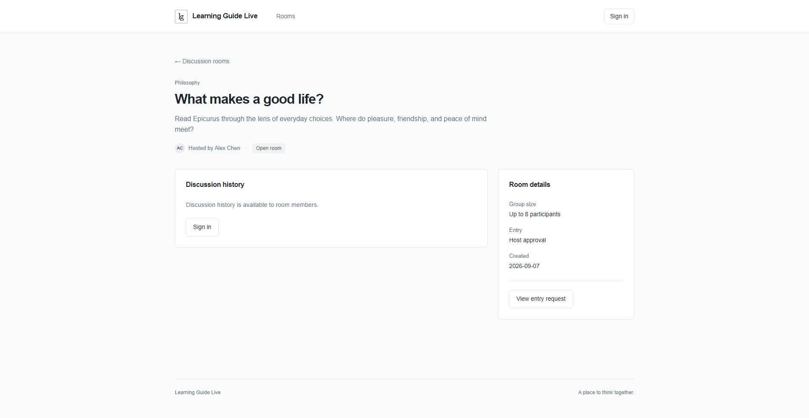
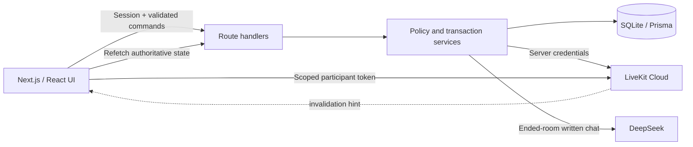

# Learning Guide Live

Learning Guide Live is a role-based study room platform for small-group discussions. It combines authenticated room admission, LiveKit audio/video, durable collaboration state, moderation controls, and chat-based AI session summaries in one Next.js application.

The interface is custom-built. LiveKit supplies WebRTC transport and room-management APIs; the application remains authoritative for identities, approval, roles, capacity, history, kicks, and room lifecycle.



## Highlights

- Email/password registration, sign-in, sign-out, and persisted sessions with Better Auth
- Topic-based rooms with expiring invitations and a host-controlled waiting room
- Host, Moderator, and Participant permissions enforced by the server
- Atomic eight-seat admission, page-generation fencing, and same-account takeover
- LiveKit camera, microphone, screen sharing, participant presence, and explicit leave
- Durable room chat, hand raising, moderator focus, server-side kick, and retryable room ending
- DeepSeek summaries generated from saved written chat after a room ends
- Isolated SQLite integration tests, concurrency checks, and a complete offline journey smoke

## Architecture



Media travels directly between browsers and LiveKit Cloud. Application commands are authenticated by Next.js and committed to SQLite. LiveKit data packets are refresh hints, not authoritative events: clients always reload durable state and use visible-page polling to recover missed packets.

See [system design](docs/DESIGN.md), [architecture decisions](docs/ARCHITECTURE_DECISIONS.md), and the [room authorization contract](docs/ROOM_RULES.md) for the full model.

## Run locally

Requirements:

- Node.js 22.22 or newer; Node.js 24 is recommended
- npm
- Optional LiveKit Cloud and DeepSeek credentials for real media and summaries

```sh
npm ci
npm run setup
npm run dev
```

Open [http://localhost:3000](http://localhost:3000). Use that exact origin because `127.0.0.1` is a different authentication origin.

`npm run setup` creates an ignored `.env` with a unique local session secret when one does not exist, applies committed migrations, and seeds synthetic demo data. It preserves existing configuration, passwords, and edited records; it never resets the database.

### Demo accounts

| Name        | Email               |
| ----------- | ------------------- |
| Alex Chen   | `alex@guide.test`   |
| Morgan Lee  | `morgan@guide.test` |
| Taylor Park | `taylor@guide.test` |

All demo accounts use `LearnTogether!2026`. They are synthetic local-development identities; do not reuse this password or seed these accounts in a public environment.

### Environment

Copy values from [.env.example](.env.example) into the ignored local `.env`:

| Variable                                               | Purpose                                                       |
| ------------------------------------------------------ | ------------------------------------------------------------- |
| `DATABASE_URL`                                         | SQLite path; defaults to `file:./dev.db`                      |
| `BETTER_AUTH_URL`                                      | Exact application origin                                      |
| `BETTER_AUTH_SECRET`                                   | Server-only session secret                                    |
| `LIVEKIT_URL`, `LIVEKIT_API_KEY`, `LIVEKIT_API_SECRET` | Server-only LiveKit Cloud configuration                       |
| `DEEPSEEK_API_KEY`, `DEEPSEEK_MODEL`                   | Server-only DeepSeek configuration for post-session summaries |

Never prefix secrets with `NEXT_PUBLIC_`, commit `.env`, or place credentials in URLs, screenshots, logs, or browser storage. Participant tokens are short-lived bearer credentials and remain in memory only.

## Verify

GitHub Actions runs the same core checks on pushes to `main` and on pull requests.

```sh
npm run format:check
npm run typecheck
npm test
npm run smoke:delivery
npm run build
```

`npm run smoke:delivery` creates and removes its own temporary SQLite database. It crosses registration, room creation, invitation/request/review, capacity, token orchestration, collaboration, moderation, ending, and persisted summary state with fake external adapters. It deliberately makes no LiveKit Cloud or DeepSeek request.

With a production build running locally, `npm run smoke:foundation` checks protected pages, member-only history, login, and logout revocation over HTTP. `npm run smoke:livekit` is an explicit real-service check that creates and removes only its own random temporary Cloud room; it does not publish camera, microphone, or screen content.

The full test layers, real-service boundaries, and latest results are documented in [testing](docs/TESTING.md) and [verification](docs/VERIFICATION.md).

## Core design choices

- **Approval, seat, and media token are separate.** Approval grants eligibility; a seat reserves capacity; a token grants bounded media access for one opaque identity.
- **SQLite is the business source of truth.** Browser roles, online flags, and LiveKit packets never authorize an action.
- **External calls use durable intermediate states.** Kick, leave, takeover, room ending, and summary generation remain conservative and retryable after partial failure.
- **Screen share has deterministic priority.** The display order is screen share, then valid moderator focus, then gallery.
- **Summaries are chat-based.** DeepSeek receives bounded persisted text, not audio, video, credentials, invitation codes, or participant tokens.

## Known limitations

- The current deployment target is local/single-instance. Distributed rate limiting, managed storage, monitoring, public HTTPS deployment, and production user administration are not included.
- Actual camera/microphone publication and shared-screen pixels still require a manual device-permission check in the target browser. Automated tests cover orchestration and layout but are not presented as media-capture evidence.
- Reconciliation resumes when an eligible page or entry request is active; there is no always-on background worker or public webhook endpoint.
- Chat has durable server writes but no client idempotency key, so a lost POST response can leave delivery ambiguous.
- Current dependency audit findings and their applicability are recorded in [references and dependency notes](docs/REFERENCES.md).

## Documentation

- [System design and ERD](docs/DESIGN.md)
- [Architecture decisions](docs/ARCHITECTURE_DECISIONS.md)
- [Authorization and lifecycle contract](docs/ROOM_RULES.md)
- [Testing strategy](docs/TESTING.md)
- [Verification evidence and limitations](docs/VERIFICATION.md)
- [Product walkthrough and engineering rationale](docs/WALKTHROUGH.md)
- [Roadmap](docs/ROADMAP.md)
- [AI-assisted development disclosure](docs/AI_USAGE.md)
- [Technical references](docs/REFERENCES.md)

## License

No open-source license has been selected yet. All rights are reserved unless a license file is added.
