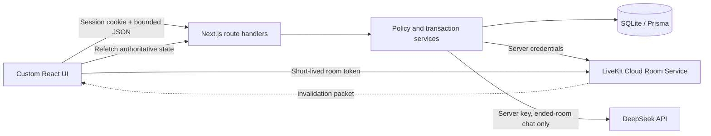
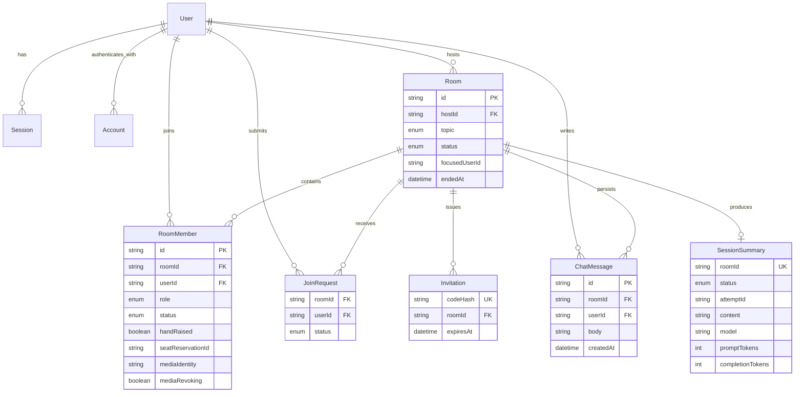

# Learning Guide Live system design

## Product boundary

Learning Guide Live is a local-first Next.js application for eight-person study discussions. LiveKit Cloud transports real-time media; the application owns accounts, admission, roles, capacity, durable collaboration and post-session summaries. SQLite is the business source of truth. The browser never decides that a user is approved, a moderator, kicked, focused or allowed to generate a summary.

Media flows directly between browser and LiveKit Cloud. It does not pass through the Next.js server. Application commands flow through authenticated route handlers and short SQL transactions. External calls are made after the durable business transition, then fenced SQL updates finish or expose a retryable partial state.

## Main flows

### Admission and media

1. Host creates an expiring invitation. SQL stores only its hash.
2. A signed-in user submits the code while it is valid. This creates a `PENDING` request, not membership or a seat.
3. Host approves. The application transaction creates/restores `APPROVED` membership. Rejection creates no membership.
4. The approved member claims one of eight SQL seats. SQLite write locking serializes the capacity count; the host is counted only while holding/using a seat.
5. Token issuance persists an opaque media identity, prepares the Cloud room with capacity eight, rechecks the same session/room/membership/seat generation, then signs a short-lived room token. Participant grants contain no room administration or arbitrary data publishing.
6. LiveKit presence reconciliation changes the member to `ACTIVE`. A signed token by itself is not online-presence proof.
7. Explicit leave or page takeover revokes the exact old Cloud identity before clearing/replacing its SQL generation. A stale page cannot free or reclaim the replacement.

### Collaboration and ending

1. Only an `ACTIVE` SQL member may chat or change their own hand state. Messages are persisted before notification.
2. Host/Moderator may lower hands and change focus. LiveKit data packets are server-originated invalidation hints; every client refetches SQL and also polls while visible because packets are not a durable queue.
3. Display priority is `screen share > valid focus > gallery`. A departed/kicked focus target is cleared or normalized away.
4. Kick first writes `KICKED` and clears dependent state, then revokes the precise Cloud identity. Failure leaves a visible retry target and conservatively keeps the media hold.
5. End first writes `OPEN → ENDING`, immediately blocking new admission/live commands. The server revokes identities and deletes/verifies the Cloud room before writing `ENDED`. Failure remains `ENDING` and Host retries the same operation.
6. After `ENDED`, Host can generate one chat-based DeepSeek summary. Members can read it; kicked users cannot. A fenced attempt prevents concurrent or delayed results from overwriting a newer retry.

## Data model

Important constraints and retention rules:

- `(roomId, userId)` is unique for memberships and join requests. Membership rows are history, not presence counters.
- Messages are indexed by `(roomId, createdAt, id)` for bounded recent-history reads. Users referenced by messages/members are restricted from deletion; deleting a room cascades its room-owned records.
- Invitations store a random-code hash and expiry. The original code is shown only at creation and carried in a URL fragment.
- A room has at most one summary. `attemptId` fences external responses; returned token counts are retained for auditability.
- Migrations are additive and committed. Setup uses `migrate deploy`; it does not reset an existing database.

## Permission matrix

| Operation                           | Host                         | Moderator             | Participant           |
| ----------------------------------- | ---------------------------- | --------------------- | --------------------- |
| Create invitations; approve/reject  | Yes                          | No                    | No                    |
| Assign/remove Moderator             | Other non-host members       | No                    | No                    |
| Claim seat / join / chat / own hand | While eligible/active        | While eligible/active | While eligible/active |
| Lower another hand; set/clear focus | While active                 | While active          | No                    |
| Kick                                | Moderator or Participant     | Participant only      | No                    |
| End/retry ending                    | Yes, even if Host left media | No                    | No                    |
| Read ended history/summary          | If not kicked                | If not kicked         | If not kicked         |
| Generate/retry summary              | ENDED room only              | No                    | No                    |

The full executable policy and target restrictions are in `src/lib/room-policy.ts` and `docs/ROOM_RULES.md`. Page controls are convenience only; route/service authorization is decisive.

## Consistency and failure strategy

| Boundary       | Durable first step             | External step                  | Failure result                                                      |
| -------------- | ------------------------------ | ------------------------------ | ------------------------------------------------------------------- |
| Chat           | Insert authorized message      | Send invalidation packet       | Message remains readable; clients poll/refetch                      |
| Token issue    | Hold identity/seat generation  | Prepare Cloud room, sign       | Capacity stays held; retry/release remains explicit                 |
| Takeover/leave | Mark exact identity revoking   | Remove/verify participant      | Old generation remains held until confirmed                         |
| Kick           | Write KICKED, clear hand/focus | Remove exact participant       | Business re-entry denied; authorized retry remains visible          |
| End            | Write ENDING                   | Revoke identities, delete room | No new live commands; Host retries teardown                         |
| Summary        | Write GENERATING + attempt ID  | Call DeepSeek                  | FAILED is persisted; stale attempt can be retried after two minutes |

SQLite write transactions acquire a room-scoped write lock before reading mutable authorization/capacity state. Network calls never hold that lock. Conditional generation/identity checks prevent an old asynchronous response from changing a newer state.

## Security and privacy

- Better Auth handles password hashing and HttpOnly/SameSite sessions. Mutations require the configured same origin, JSON, bounded bodies and current server-loaded identity.
- LiveKit secret and DeepSeek key are server-only `.env` values. No secret is prefixed `NEXT_PUBLIC_`, written to URLs/storage/logs, committed, or returned to the browser. A participant token remains a sensitive bearer token and is held in memory only.
- Media identities and room names are opaque. The application sends DeepSeek only bounded room metadata and persisted written chat—not email, invitation codes, credentials, audio or video.
- The summary prompt treats room/chat text as untrusted source material, forbids claims about unheard/unseen content, limits output, stores provider usage and never auto-retries a paid call.
- Local rate limiting is single-process. This local demo is not presented as public, multi-instance or production hardened.

## Deliberate scope and known limitations

- No recording, transcription, voice summary, public deployment, payment, email delivery, unban or production admin console.
- Automated browsers proved two-client Cloud connection, presence, page takeover, chat/focus, kick and end with devices off. This environment denied camera permission and blocked selecting screen content for external transmission, so actual camera/microphone media and shared screen pixels still need a short manual check before submission. Layout/device code and deterministic tests pass, but those are not equivalent to captured media evidence.
- An unexpected lost POST response can leave chat delivery ambiguous; the database prevents duplicate application requests but chat does not implement client idempotency keys or exactly-once delivery.
- With every local page closed there is no background daemon or public webhook; Cloud reconciliation resumes on the next eligible page/entry request.
- Dependency audit applicability and current provider references are documented in `docs/REFERENCES.md`; this is not a claim of a complete security audit.
